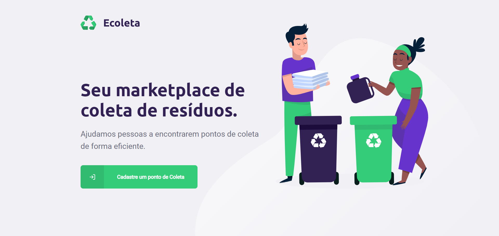

  

# Sobre o Projeto

Com o intuito de celebrar a Semana Nacional do Meio Ambiente, o Ecoleta é um projeto que facilita a coleta responsável de resíduos e materiais, aproximando consumidores de pontos onde pode-se realizar o descarte correto desse items, além de ser uma ferramenta colaborativa, permitindo a incersão de novos pontos.  

Este projeto foi desenvolvido pela @Rocketseat para a primeira edição da Next Level Week, uma semana repleta de desafios com o intuito de alavancar a evolução de desenvolvedores, usando tecnologias front-end e back-end como:

- React e React Native: *Uma biblioteca JavaScript para criar interfaces de usuário e apps nativos para Android e iOS*
- Redux: *Contêiner de estado previsível para aplicativos JavaScript.*
- Axios: *O Axios é um cliente HTTP baseado em Promises para Browser e NodeJS*
- Express: *É um Framework para aplicativo da web do Node.js mínimo e flexível que fornece um conjunto robusto de recursos para aplicativos web e móvel*
- Node.js: *Ambiente de execução Javascript server-side*
